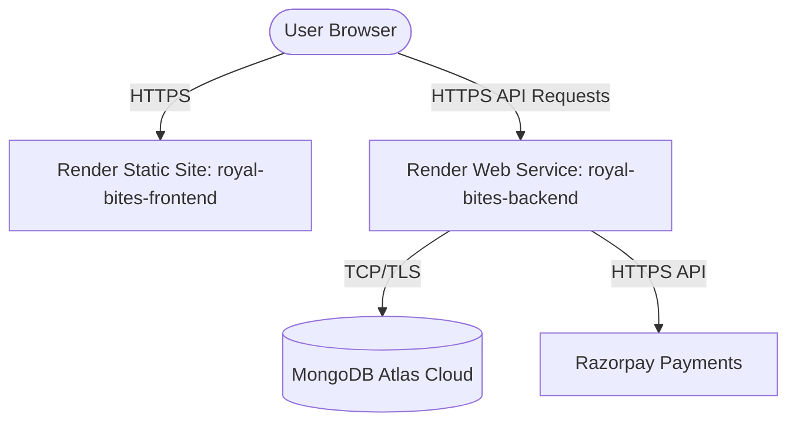

# Royal Bites — Render Deployment Guide

This guide provides step-by-step instructions to deploy both the **React Frontend** and **Express/Node.js Backend** of Royal Bites on Render using MongoDB Atlas.

---

## 🏗️ Architecture Overview

The application is deployed using a decoupled architecture on Render:
* **Backend**: Hosted as a **Web Service** running Node.js.
* **Frontend**: Hosted as a **Static Site** serving the compiled Vite React single-page app (SPA).

---

## 💾 Phase 1: MongoDB Atlas Setup

Before deploying the services, set up your MongoDB cloud database:

1. Sign up or log in to [MongoDB Atlas](https://www.mongodb.com/cloud/atlas).
2. Create a new database cluster (select the **Free M10 / Shared** tier).
3. Under **Database Access**, create a user with read/write privileges and note the password.
4. Under **Network Access**, add a rule to allow connections from **Anywhere (`0.0.0.0/0`)** since Render dynamic IPs change regularly.
5. Click **Connect** on your cluster, select **Drivers**, choose **Node.js**, and copy your connection string. It will look like:
   `mongodb+srv://<username>:<password>@cluster.xxxx.mongodb.net/royal-bites?retryWrites=true&w=majority`

---

## ⚙️ Phase 2: Environment Variables Reference

Ensure you have these variables ready for configuration in the Render dashboard:

### Backend (Web Service)

| Variable | Description | Example / Fallback |
| :--- | :--- | :--- |
| `PORT` | The port Express listens to (set automatically by Render) | `5000` |
| `MONGO_URI` | Your MongoDB Atlas connection string | `mongodb+srv://...` |
| `JWT_SECRET` | Secret token signing key (Render can generate this automatically) | `royalbites_jwt_secret_2026` |
| `ADMIN_PASSWORD` | Password for accessing the admin panel dashboard | `royalbites2026` |
| `RAZORPAY_KEY_ID` | Razorpay sandbox/live key ID (optional, defaults to simulation) | `rzp_test_xxxxxx` |
| `RAZORPAY_KEY_SECRET`| Razorpay secret key (optional, defaults to simulation) | `dummySecret2026` |
| `FRONTEND_URL` | The URL of your deployed frontend static site | `https://royal-bites.onrender.com` |
| `WHATSAPP_NUMBER` | Contact phone number for inquiries and orders | `1234567890` |

### Frontend (Static Site)

| Variable | Description | Example |
| :--- | :--- | :--- |
| `VITE_API_URL` | The full HTTP endpoint of your deployed backend web service | `https://royal-bites-backend.onrender.com` |

---

## 🚀 Phase 3: Deployment Options on Render

You can deploy using **Blueprint (one-click declaration)** or manually via the Render Dashboard.

### Option A: Blueprint Deployment (Recommended)

1. Push your repository to GitHub or GitLab.
2. Go to the [Render Blueprints Dashboard](https://dashboard.render.com/blueprints).
3. Click **New Blueprint Instance**.
4. Select your repository. Render will automatically read the `render.yaml` file from the root.
5. Fill in the requested secret values:
   * `MONGO_URI`
   * `ADMIN_PASSWORD`
   * `FRONTEND_URL` (You can update this after the frontend service is initialized)
6. Click **Approve** to deploy both services simultaneously!

---

### Option B: Manual Dashboard Deployment

#### Step 1: Deploy Backend (Web Service)
1. In the Render Dashboard, click **New +** > **Web Service**.
2. Connect your GitHub repository.
3. Configure the following settings:
   * **Name**: `royal-bites-backend`
   * **Language**: `Node`
   * **Build Command**: `npm install --prefix server`
   * **Start Command**: `npm start --prefix server`
4. Under **Advanced**, add the environment variables listed in the *Backend* table above.
5. Click **Create Web Service**. Once built, copy the backend service URL (e.g. `https://royal-bites-backend.onrender.com`).

#### Step 2: Deploy Frontend (Static Site)
1. Click **New +** > **Static Site**.
2. Connect your repository.
3. Configure the following settings:
   * **Name**: `royal-bites-frontend`
   * **Build Command**: `npm install --prefix client && npm run build --prefix client`
   * **Publish Directory**: `client/dist`
4. Under **Advanced**, add the environment variables:
   * Key: `VITE_API_URL`
   * Value: `https://royal-bites-backend.onrender.com` (replace with your actual backend URL)
5. Under **Redirects/Rewrites**, click **Add Rule**:
   * **Source**: `/*`
   * **Destination**: `/index.html`
   * **Action**: `Rewrite` (required for React Router Single Page App routing)
6. Click **Create Static Site**.

> [!IMPORTANT]
> Once your frontend static site is built, copy its URL (e.g. `https://royal-bites-frontend.onrender.com`), go back to your backend **Web Service settings**, and update `FRONTEND_URL` with this value to ensure CORS allows credentials and secure cookie handling.

---

## 🛠️ Verification & Post-Deployment Checklist

- [ ] **Health Check**: Visit `https://your-backend.onrender.com/api/health` in your browser. It should return a success JSON message.
- [ ] **Admin Authentication**: Access the admin page (`https://your-frontend.onrender.com/admin`) and verify you can authenticate using your configured `ADMIN_PASSWORD`.
- [ ] **Menu Loading**: Ensure all dishes, categories, and prices load from MongoDB (or local fallback menu if database is unreachable).
- [ ] **Bookings**: Attempt to book a table. Verify it confirms with the Toast notification.
- [ ] **Orders & Payments**: Add items to the cart, apply a coupon (e.g. `ROYAL10`), and place an order. If `RAZORPAY_KEY_ID` is dummy, the system automatically uses Sandbox simulation.
- [ ] **Reviews**: Submit a review on the menu items and verify it posts successfully.
